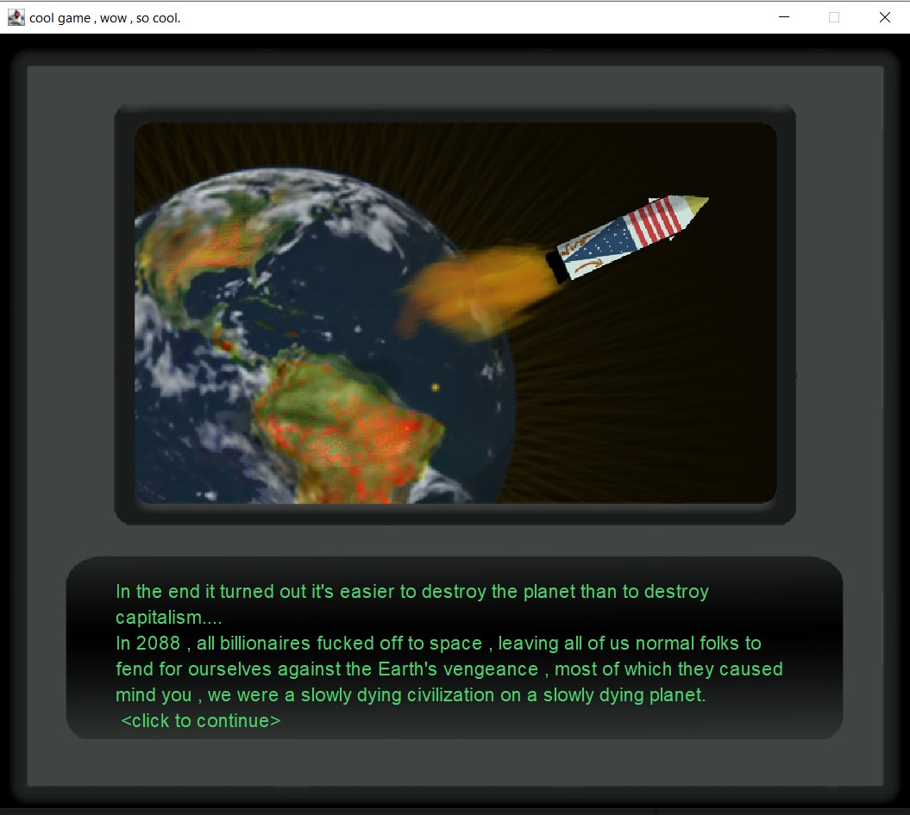

# The glass pyramid: A video game by Ahmed Elsarta.

## Summary
In 2020 I started playing a lot of fallout new vegas and was really intrigued by the story structure, branching paths and so on, so I though to make a similar experience with a story of my own (and also an excuse to dig deeper into Java).

The whole game is just the dialogue box, you talk to people, go places and decide what do you want to do.

Oh and by the way, it's not finished yet, most of the first half of the story is there, the artwork stops after screen 2.
But there is exactly ONE ending you can get (check devlog.java for more info.)

## screenshots from the game
### the intro screen

### the first screen

## The technical stuff
### GUI
the user interface is made using the swift framework, with the ux design being sketched in photoshop.
### Story engine
the story tree (or bush, IDK) is made using a single switch statement, with a flag that indicates your position inside the tree, whenever you click an option you enter the tree and then your position changes inside the method, and on an on until you get to the end of the game, it's not an engine, it's a single piston jumping up and down on a string that you move.

## The artsy stuff

### The artwork.
The artwork was made by me, in photoshop.
### The jokes
There's a lot of jokes in There.

## Future work
1. actually finishing the Story, I just got bored of writing the whole thing, if anyone is interested to hear the story you can message me on [my linkedin](https://www.linkedin.com/in/ahmed-elsarta-a67b75193/), sorry, I can't give out my personal accounts just like that, you have to play the game at least.
2. Adding music (preferably played by me.)
3. Adding voice over to some of the characters.
4. Improving the UI a bit.
5. getting a writing gig in a videogame studio. :)
